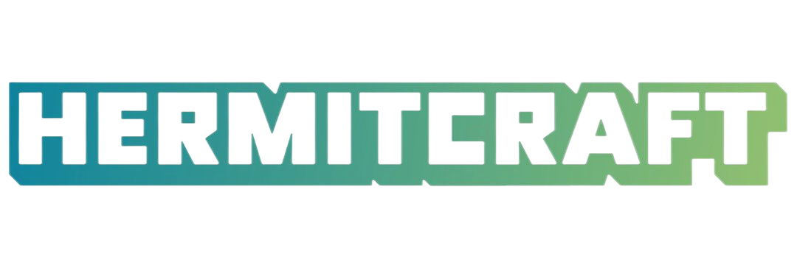

 

This is an unofficial redesign of the [hermitcraft.com](https://hermitcraft.com) website.

> **Note**   **This website is not affiliated with, endorsed by, or associated with Hermitcraft or its members.**  

The project uses the YouTube and Twitch APIs to fetch data about the channels and videos. The goal is to provide a better user experience for the Hermitcraft community.

Visit the website at https://hermitcraft.up.railway.app.

## Credits

- [hermitcraft.com](https://hermitcraft.com) (The original website)
- [r8y](https://github.com/davis7dotsh/r8y) (The infra is heavily inspired by r8y)

## License

Licensed under the [MIT license](https://github.com/EpicAlbin03/hermitcraft/blob/main/LICENSE.md).
